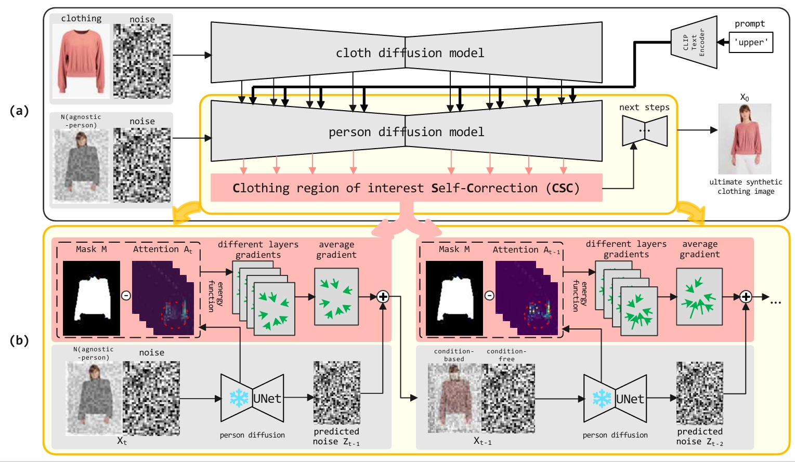

# CSC method for [Training-free Clothing Region of Interest Self-correction for Virtual Try-On]

## CCFC - PRICAI 2025

[](https://github.com/MrWhiteSmall/CSC-VTON)    [](https://arxiv.org/pdf/2512.07126)  [](https://huggingface.co/levihsu/OOTDiffusion)   <a href="#LICENSE--citation"></a>


## Main Method

> **Overview**. The framework of the proposed clothing region of interest self-correction approach (CSC) is illustrated in this figure. Its inputs are clothing image, person image and the textual prompt to describe the target clothing. These inputs are first passed into the clothing diffusion model C-UNet to fuse clothing features into each layer of the person diffusion model P-UNet, outputting the generated clothing image. CSC imposes constraints on the attention map extracted during the denoising process, making the generating process place more emphasis on the Clothing Region of Interest (C-RoI). C-ROI is the region where target clothing is synthesized onto a person after each step's sampling is completed. It shapes the attention distribution in subsequent steps, effectively addressing information loss of clothing details within C-RoI.

*Abstract*: VTON (Virtual Try-ON) aims at synthesizing the target clothing on a certain person, preserving the details of the target clothing while keeping the rest of the person unchanged. Existing methods suffer from the discrepancies between the generated clothing results and the target ones, in terms of the patterns, textures and boundaries. Therefore, we propose to use an energy function to impose constraints on the attention map extracted through the generation process. Thus, at each generation step, the attention can be more focused on the clothing region of interest, thereby influencing the generation results to be more consistent with the target clothing details. Furthermore, to address the limitation that existing evaluation metrics concentrate solely on image realism and overlook the alignment with target elements, we design a new metric, Virtual Try-on Inception Distance (VTID), to bridge this gap and ensure a more comprehensive assessment. On the VITON-HD and DressCode datasets, our approach has outperformed the previous state-of-the-art (SOTA) methods by 1.4%, 2.3%, 12.3%, and 5.8% in the traditional metrics of LPIPS, FID, KID, and the new VTID metrics, respectively. Additionally, by applying the generated data to downstream Clothing-Change Re-identification (CC-Reid) methods, we have achieved performance improvements of 2.5%, 1.1%, and 1.6% on the LTCC, PRCC, VC-Clothes datasets in the metrics of Rank-1.


## Pretrained Models

[MODEL](https://huggingface.co/levihsu/OOTDiffusion)

## Prepare Environment
~~~
pip install -r requirements.txt
~~~

## Prepare Dataset
VTON-HD

链接：https://pan.baidu.com/s/1d3dWIcueYunhjeH5Bh_-TA 
提取码：aeuz

DressCode

链接：https://pan.baidu.com/s/1UrLH_4-L7hsgXbccu03n9g 
提取码：2dad

## Try Inference

~~~python
python run/run_ootd_reid.py
~~~

## Citation
```
@article{lu2025csc,
  title={Training-free Clothing Region of Interest Self-correction for Virtual Try-On},
  author={Shengjie Lu, Zhibin Wan, Jiejie Liu, Quan Zhang, Mingjie Sun},
  journal={arXiv preprint arXiv:2512.07126},
  year={2025}
}
```

## Acknowledgement
We thank the great works [OOTDiffusion](https://github.com/levihsu/OOTDiffusion) and [FreeDOM](https://github.com/yujiwen/FreeDoM) for assisting with our work.


## License
The code and dataset in this repository are licensed under the [MIT license](https://mit-license.org/).